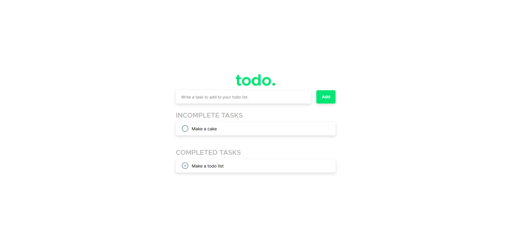

# todo.
This is a basic todo list, created in React.js. The styling is done with SCSS.

## What does it look like?
Well, below you can see a screenshot of the final version (as of 15/11/20 @ 4:30pm AEST).
